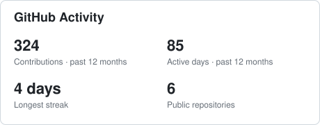
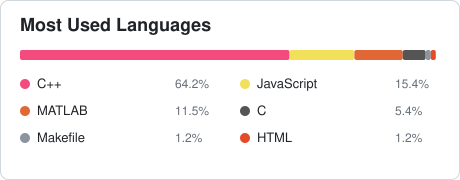

### 👋 Hi, I’m Aaron.
- 🎓 I’m a undergraduate student pursuing BSc. in Computer Science.
- 🏫 I’m currently studying at Macau University of Science and Technology.
- 💞️ I’m interested in C, C++, Java, Matlab, LaTeX
- 📫 You can reach me at <aaron.z.chiu@gmail.com>
- 😄 Pronouns: he/him
- 💬 Preferred Language: Chinese(Native), English(Professional), Cantonese(Basic)

  
  

<!---
aaron-z-chiu/aaron-z-chiu is a ✨ special ✨ repository because its `README.md` (this file) appears on your GitHub profile.
You can click the Preview link to take a look at your changes.
--->
